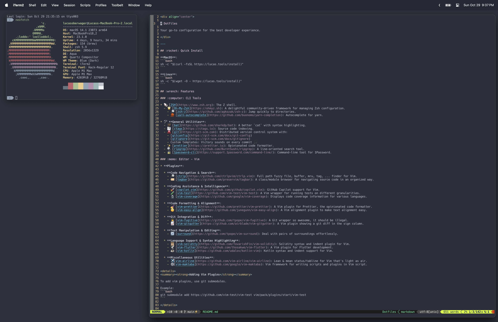

<div align="center">

# Dotfiles

</div>

---



## :rocket: Quick Install

**MacOS**:
```bash
sh -c "$(curl -fsSL lucas.tools/install)"
```

**Linux**:
```bash
sh -c "$(wget -O - lucas.tools/install)"
```

## :wrench: Features

### :computer: CLI Tools

* 🐚 [ZSH](https://www.zsh.org): The Z shell.
  - 🌟 [Oh-My-Zsh](https://ohmyz.sh): A delightful community-driven framework for managing Zsh configuration.
    - 🔎 [zsh-z](https://github.com/agkozak/zsh-z): Jump quickly to directories.
    - 🧶 [yarn-autocomplete](https://github.com/buonomo/yarn-completion): Autocomplete for yarn.

* 🛠 **General Utilities**:
  - 🦇 [bat](https://github.com/sharkdp/bat): A better `cat` with syntax highlighting.
  - 📑 [ctags](https://ctags.io): Source code indexing.
  - 🐙 [git](https://git-scm.com): Distributed version control system with:
    - [gitconfig](https://git-scm.com/docs/git-config)
    - [gitignore](https://git-scm.com/docs/gitignore)
    - Custom templates: Victory sounds on every commit 🎵
  - ✨ [prettier](https://prettier.io): Opinionated code formatter.
  - 🔍 [ripgrep](https://github.com/BurntSushi/ripgrep): A line-oriented search tool.
  - 🔒 [1password-cli](https://support.1password.com/command-line/): Command-line tool for 1Password.
  - 🔳 [rectangle](https://rectangleapp.com): Window management for macOS.

### :memo: Editor - Vim

* **Plugins**:

  * **Code Navigation & Search**:
    - 🔎 [ctrlp](https://github.com/ctrlpvim/ctrlp.vim): Full path fuzzy file, buffer, mru, tag, ... finder for Vim.
    - 🏷 [tagbar](https://github.com/preservim/tagbar): A class/module browser for navigating source code in an organized way.
    - 🍇 [vim-vinegar](https://github.com/tpope/vim-vinegar): Enhance Vim's built-in directory browser.

  * **Coding Assistance & Intelligence**:
    - 🚀 [copilot.vim](https://github.com/github/copilot.vim): GitHub Copilot support for Vim.
    - 🧪 [vim-test](https://github.com/vim-test/vim-test): A Vim wrapper for running tests on different granularities.
    - 🔬 [vim-coverage](https://github.com/google/vim-coverage): Displays code coverage information for various languages.

  * **Code Formatting & Alignment**:
    - 💅 [vim-prettier](https://github.com/prettier/vim-prettier): A Vim plugin for Prettier, the opinionated code formatter.
    - 🧐 [vim-easy-align](https://github.com/junegunn/vim-easy-align): A Vim alignment plugin to make text alignment easy.
    - 🌑 [vim-carbon-now](https://github.com/kristijanhusak/vim-carbon-now-sh): A Vim plugin for opening the current buffer in carbon.now.sh for beautiful code screenshots.

  * **Git Integration & Diff**:
    - 🕵️ [vim-fugitive](https://github.com/tpope/vim-fugitive): A Git wrapper so awesome, it should be illegal.
    - 📈 [vim-gitgutter](https://github.com/airblade/vim-gitgutter): A Vim plugin showing a git diff in the sign column.
    - 📝 [vim-gh-line](https://github.com/ruanyl/vim-gh-line): Open GitHub URL for the current file/selection/line.

  * **Linting & Syntax Checking**:
    - 🛠️ [ALE](https://github.com/dense-analysis/ale): Asynchronous linting/fixing for Vim.

  * **Text Manipulation & Editing**:
    - 🔄 [surround](https://github.com/tpope/vim-surround): Deal with pairs of surroundings effortlessly.

  * **Language Support & Syntax Highlighting**:
    - 📜 [vim-solidity](https://github.com/TovarishFin/vim-solidity): Solidity syntax and indent plugin for Vim.
    - 🕊 [vim-flutter](https://github.com/thosakwe/vim-flutter): A Vim plugin for Flutter development.
    - ☕ [vim-kotlin](https://github.com/udalov/kotlin-vim): Kotlin syntax and indent support for Vim.
    - 🪐 [vim-jupyter](https://github.com/jupyter-vim/jupyter-vim.git): Juypter notebooks for Vim.
    - 🐹 [vim-go](https://github.com/fatih/vim-go): Go development plugin for Vim.
    - 🗃️ [vim-jsonl](https://github.com/kyoh86/vim-jsonl): JSONL syntax highlighting for Vim.

  * **Miscellaneous Utilities**:
    - ✈️ [vim-airline](https://github.com/vim-airline/vim-airline): Lean & mean status/tabline for Vim that's light as air.
    - ⚙️ [vim-maktaba](https://github.com/google/vim-maktaba): Vim framework for writing scripts and plugins in Vim script.
    - 🔀 [vim-tmux-navigator](https://github.com/christoomey/vim-tmux-navigator): Seamless navigation between tmux panes and vim splits.

<details>
<summary><strong>Adding Vim Plugins</strong></summary>

To add vim plugins, use git submodules.

Example:
```bash
git submodule add https://github.com/vim-test/vim-test vim/pack/plugins/start/vim-test
```

</details>

### :art: Aesthetics

* 🖋 [Hack](https://sourcefoundry.org/hack/): A typeface for source code.

## :apple: MacOS Exclusives

* **Applications**:
  - 👓 [Dozer](https://github.com/Mortennn/Dozer): Hide menu bar items.
  - 🖥 [Ghostty](https://ghostty.org): Fast cross-platform terminal emulator.
  - 🎵 [Spotify](https://www.spotify.com): Music streaming service.
  - 🔒 [1Password](https://1password.com): Password manager.

* **Preferences**:
  - Dive into abundant system preferences changes in [`osx/preferences.sh`](osx/preferences.sh).
  - 🖐 Use `TouchID` for sudo commands.
  - 🌄 Gray background
  - ⚠️ **Everything's reversible!** Run `osx-backup.sh` to restore your original settings.

## :arrows_counterclockwise: Updating

Keep your configurations fresh and up-to-date!

- :white_check_mark: **Easy Update**: Run the install script again, and it'll automatically check for the latest configurations.

  ```bash
  sh -c "$(curl -fsSL https://lucas.tools/install)"
  ```

- :stop_sign: **No Redundancy**: By default, if there are no new git commits, nothing is changed.

- :zap: **Force Update**: Want to ensure the latest and greatest? Use the `-f` flag to force the installation.

  ```bash
  sh -c "$(curl -fsSL https://lucas.tools/install)" -- -f
  ```

---

<div align="center">
  <sub><a href="https://lucas.tools">Lucas.Tools</a></sub>
</div>

---
